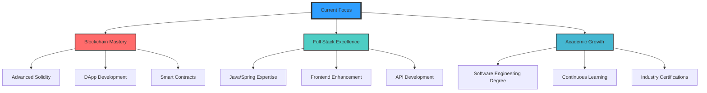

<div align="center">
  
<!-- Bannner personalizado con tu nombre -->


[;Future+Software+Engineer)](https://git.io/typing-svg)

<div align="center">

</div>

<p align="center">
  <a href="https://www.linkedin.com/in/diego-andres-ramirez-mejia-1584a5323">
    
  </a>
  <a href="mailto:diiegomejiasobsu@gmail.com">
    
  </a>
  
  
</p>

</div>

##  About Me


```typescript
// Passionate about coding and blockchain technology
const AboutMe = {
    profile: {
        name: "Diego Andrés Ramírez Mejía",
        role: "Fullstack Developer",
        location: "Medellín, Colombia",
        age: 18
    },
    
    skills: {
        languages: ["Spanish (Native)", "English (B1)"],
        code: ["Java", "JavaScript", "Python", "Solidity"],
        tools: ["Spring Boot", "Node.js", "Web3.js"]
    },
    
    achievements: {
        hackathons: [{
            name: "HackAvax Medellín",
            position: "3rd Place 🥉",
            year: 2023,
            tech: ["Solidity", "Web3.js", "Blockchain"]
        }]
    },
    
    currentFocus: [
        "🔥 Mastering Blockchain Development",
        "💻 Enhancing Fullstack Skills",
        "📚 Preparing for Software Engineering Studies"
    ],

    funFact: "Started coding at 18 and already winning hackathons! 🚀"
};
```

## 🛠️ Technology Arsenal

<table align="center">
<tr><td align="center" width="50%">

### Frontend Development
<div align="center">  
  
  
  

</div>

</td><td align="center" width="50%">

### Backend Development
<div align="center">  
  
  
  
  
</div>

</td></tr>

<tr><td align="center">

### Blockchain Development
<div align="center">  
  

</div>

</td><td align="center">

### Tools & DevOps
<div align="center">  
  
  
</div>
</td></tr>
</table>

## 📊 GitHub Analytics

<div align="center">
  
  
</div>

<div align="center">
  
</div>

### 📈 Contribution Graph

<div align="center">
  
</div>

## 🎯 Current Focus & Roadmap



### 🏆 GitHub Profile Trophy

<div align="center">
  
</div>

## 📫 Connect With Me

<div align="center">
  <a href="https://www.linkedin.com/in/diego-andres-ramirez-mejia-1584a5323">
    
  </a>
  <a href="mailto:diiegomejiasobsu@gmail.com">
    
  </a>
</div>

<div align="center">
  
### 💡 "Building the future, one commit at a time" 

</div>


